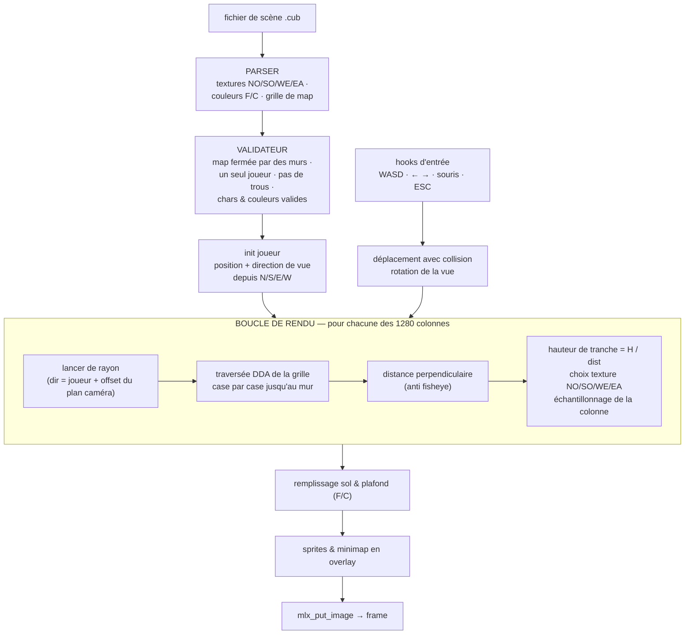

# cub3D

 

Un moteur de raycasting dans le style de Wolfenstein 3D : un labyrinthe 3D explorable rendu depuis une grille 2D, un rayon par colonne d'écran, traversée DDA, tranches de mur mises à l'échelle selon la distance. Tourne en 1280×720 avec murs texturés, minimap, sprites et visée souris.

## Pipeline de raycasting



## Le format de scène `.cub`

```
NO ./textures/north.xpm      SO ./textures/south.xpm
WE ./textures/west.xpm       EA ./textures/east.xpm
F 220,100,0                  C 225,30,0

111111
1000N1
100011
111111
```

Le parser rejette tout ce qui est invalide avec une ligne `Error` : le dépôt embarque plus de 20 maps pièges (`maps/test_*.cub`) couvrant textures dupliquées, débordements de couleur, murs ouverts, joueur manquant, caractères parasites, lignes vides dans la map.

## Contrôles

| Entrée | Action |
|:---:|---|
| `W` `A` `S` `D` | avancer / strafer |
| `←` `→` ou souris | tourner la caméra |
| `ESC` / croix de la fenêtre | sortie propre |

## Structure

```
cub3d/
├── srcs/
│   ├── parsing/       # lecture .cub, grille, textures, couleurs, sprites
│   ├── check/         # vérification des arguments & extensions
│   ├── player/        # position de spawn & vecteurs de direction
│   ├── raycasting/    # préparation des rayons & DDA
│   ├── rendering/     # dessin des frames, textures, sprites, minimap
│   ├── events/        # hooks clavier & souris
│   └── cleanup/       # libération centralisée des ressources
├── includes/          # cub3d.h (1280×720, FOV, vitesses)
├── maps/              # 1 map valide + 20 maps pièges invalides
├── textures/          # textures de murs XPM
├── minilibx-linux/
└── libft/
```

## Compilation & lancement

```bash
sudo apt install libx11-dev libxext-dev
make
./cub3D maps/valid.cub
```
