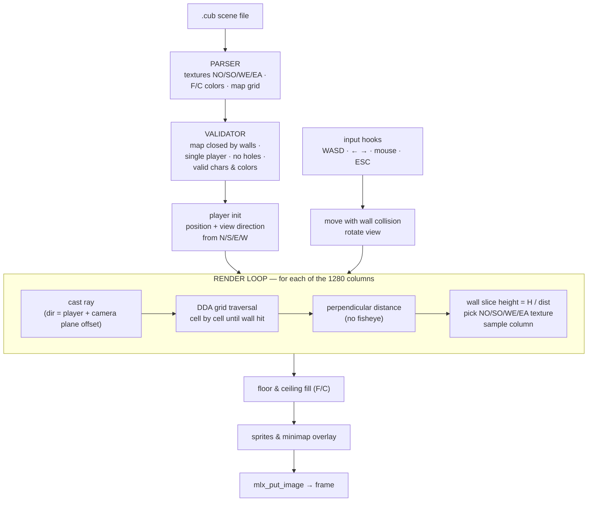

# cub3D

 

A raycasting engine in the style of Wolfenstein 3D: an explorable 3D maze rendered from a 2D grid map, one ray per screen column, DDA traversal, wall slices scaled by distance. Runs at 1280×720 with textured walls, a minimap, sprites and mouse look.

## Raycasting pipeline



## The `.cub` scene format

```
NO ./textures/north.xpm      SO ./textures/south.xpm
WE ./textures/west.xpm       EA ./textures/east.xpm
F 220,100,0                  C 225,30,0

111111
1000N1
100011
111111
```

The parser rejects everything invalid with an `Error` line: the repo ships 20+ trap maps (`maps/test_*.cub`) covering duplicate textures, color overflows, open walls, missing player, stray characters, embedded newlines.

## Controls

| Input | Action |
|:---:|---|
| `W` `A` `S` `D` | move / strafe |
| `←` `→` or mouse | rotate the camera |
| `ESC` / window ✕ | clean exit |

## Structure

```
cub3d/
├── srcs/
│   ├── parsing/       # .cub reading, grid, textures, colors, sprites
│   ├── check/         # argument & extension checks
│   ├── player/        # spawn position & direction vectors
│   ├── raycasting/    # ray setup & DDA
│   ├── rendering/     # frame drawing, textures, sprites, minimap
│   ├── events/        # keyboard & mouse hooks
│   └── cleanup/       # centralized resource release
├── includes/          # cub3d.h (1280×720, FOV, speeds)
├── maps/              # 1 valid map + 20 invalid trap maps
├── textures/          # XPM wall textures
├── minilibx-linux/
└── libft/
```

## Build & run

```bash
sudo apt install libx11-dev libxext-dev
make
./cub3D maps/valid.cub
```
